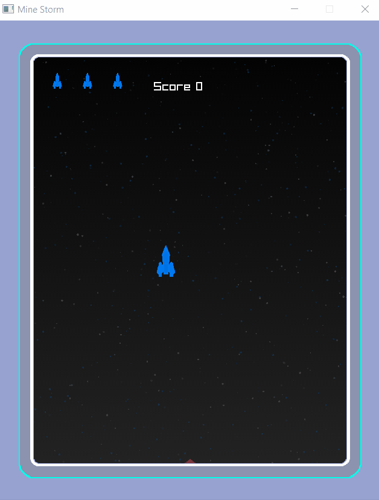
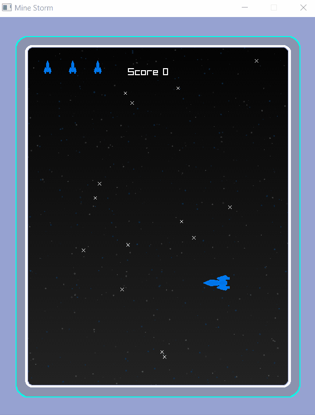
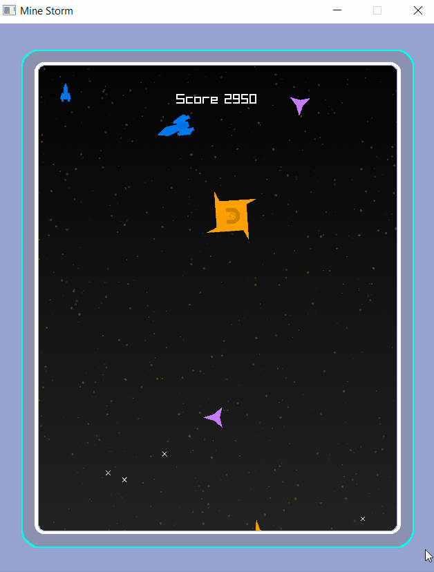
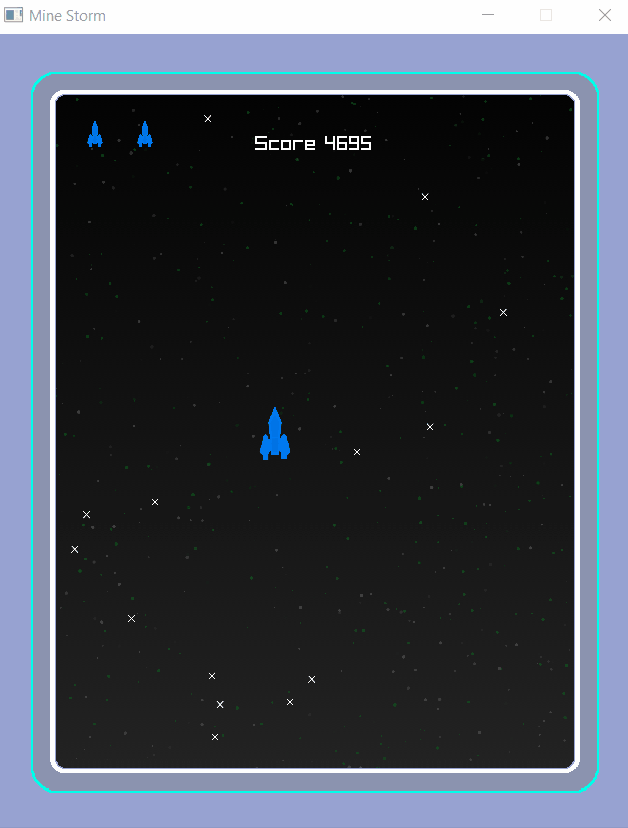
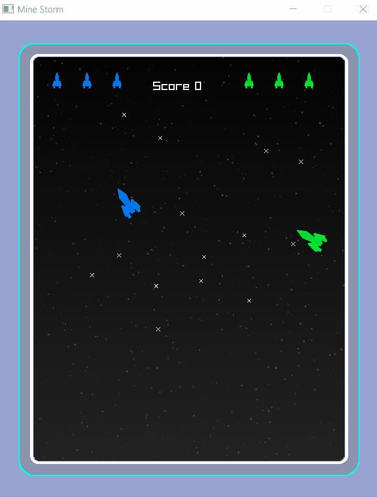
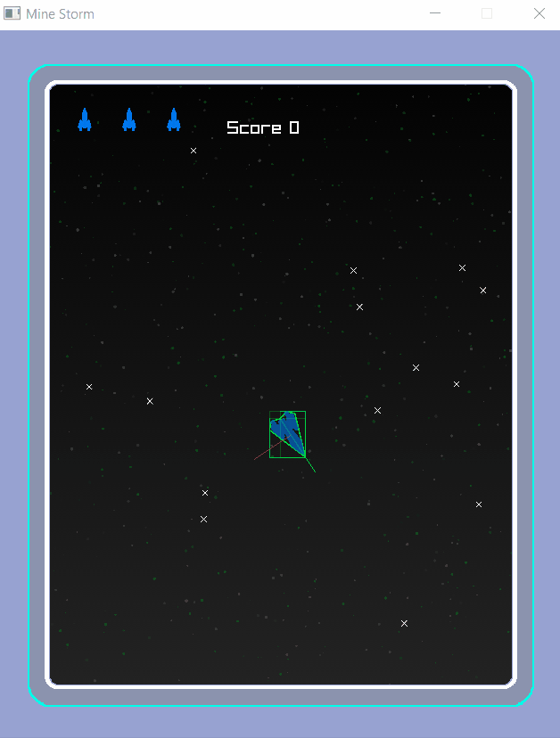

Minesotrm par Noé Mouchel 24/11/2020

---
# **Sommaire**

- ## How to play
- ## Description
- ## Inputs
- ## Maths tools
- ## Features
- ## Known bugs
- ## Images

---
# **How to play**

### **Prerequisite**
>Make sure the file **raylib.dll** is in: x64/release/

### **Compile**
>Compile the project in visual studio

### **Start**
>Execute the **start.bat** file

---
# **Description**

This Minesotrm was produced as part of a first year Game Programming project.

The game was codded in C++ using the "raylib" library.

---
### **Game rules:**

The player control a spaceship allowing to destroy the enemies present on the screen.

If your ship collides with an enemy mine, you lose a life and restart the round.

The game ends if the player loses all his three lives (in single player mode) or if both players each lose their three lives (in two players mode).

The ***Game Over*** screen apperas to display the score of the game. You can then return to the main menu by pressing the 'Q' key (QWERTY).

### **player(s):**
	The player controls a spaceship that can move forward and change direction, it moves with inertia according to Newton's law.
	
	He can shoot in its direction in an attempt to destroy an enemy or an enemy bullet.
	
	Destroying an enemy and an enemy bullet gives points
	
	He owns three lives by default, he loses one in contact with an enemy or an enemy bullet(enely or ally) and respawns, the round reset.

When the round is cleared, a new, more difficult level is started.

### **Ennemies:**

	At the start of the level, spawn points are randomly placed on the screen by an indestructible ship (1 spawn point/ 1 mine).

	To begin, only large mines spawns on one of those positions, once it appeared, the spawn point disappear.

	When a large mine is destroyed, two medium mines of the same type appear.
	Likewise for a medium mine, once destoyed, two small mines appear.
	(1 large mine destroyed -> 2 medium mines destroyed -> 4 small mines, in total there are 7 enemy mines)

	when all the spawn points have been used, a ship(Minelayer) comes to place new spawn points one by one . This ship is destructible, several bullets are necesary to destroy it.

Each border provides access to the opposite side of the screen.
As a result, enemies, players and bullets (fireball and player bullet) can move through the borders to reach a position more quickly.

---
# **Inputs**

	- 'SPACE' -> Pause game / Resume game

In Pause menu or in Game over screen :

	- 'Q' -> Return to main menu (QWERTY  keyboard) 

Player 1:

	- 'R' -> move foward
	- 'F' -> shoot
	- 'D' and 'G' -> rotate
	- 'E' and 'T' +> teleport

Player 2:

	- 'T' -> move foward
	- 'K' -> shoot
	- 'J' and 'L' -> rotate
	- 'U' and 'O' -> teleport	

Debug mode(*shows collisions boxes and guizmo of eah referential*) :

	- 'C' -> : Activate/Deactivate debug mode

	

---
# **Maths tools**

Primitives classes can be found in: 

	toolBox/primitives2.h

Vector2f class can be found in :

	toolBox/vector2.h
	toolBox/vector2.cpp

Method of referential change ***(Local <-> World)*** can be found in :

	toolBox/referential2.h
	toolBox/referential2.cpp

SAT method of collision detection can be found in:

	toolBox/collision2.h
	toolBox/collision2.cpp

The method of applying the Newtonian dynamic model as well as the management of the drift can be found in the file: 

	src/player.cpp (Frome line 110) in function displacement(float deltaTime)

SAT method used in the project are in:

	src/entitiesManager.cpp  From line 160

	include/Collider.h	(polymorphism with the following three classes)

	src/multiPolygonCollider.cpp
	include/multiPolygonCollider.h

	src/PolygonCollider.cpp
	include/PolygonCollider.h 

	src/CircleCollider.cpp
	include/CircleCollider.h

	src/boxCollider.cpp
	include/boxCollider.h (AABB)

---
# **Features**

### **Sound:**
 - Displacements
 - Teleportations
 - Explosions(players,enemies,shoots)
 - music
 - ambient

### **Animations (particles):**
 - Displacements 
 - Teleportations
 - Explosions(players,enemies,shoots)
 - stars in the background(change color with the round number)

### **Particularities:**
- Minelayer is more robust.
- Rounds are unlimited (round 100 are almost impossible)
- Border and background are personnalized.

---
# **Known bugs**

- Sometimes sounds accumulate badly.
- Two player mode, the keyboard do not accept multiple key use at the same time

# **Images**

## **Main menu :**

## **Pause menu :**

## **Game over screen :**

## **Game start :**

## **Spawn + player_shoot :**

## **Mine following player :**

## **Fireballs :**

## **Two players :**

## **Collision box :**
